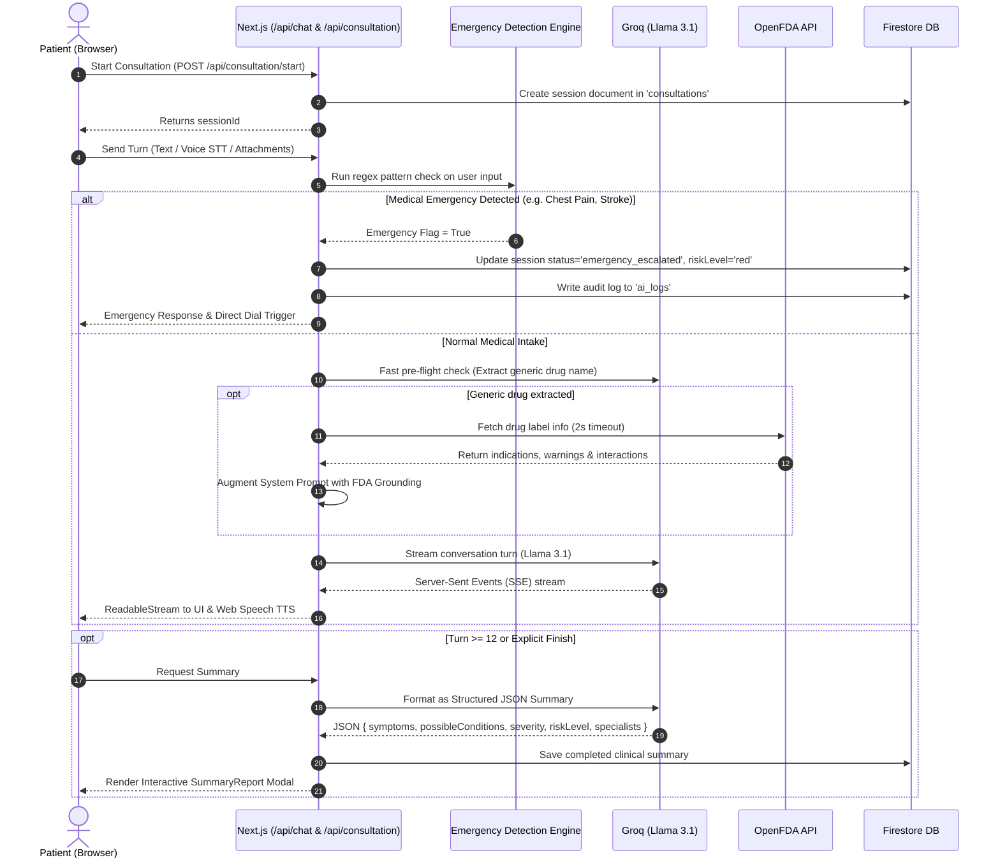

# NavOk Heal — Comprehensive System Architecture & Developer Guide

## 1. Executive Summary & Overview
**NavOk Heal** is a next-generation AI-powered digital healthcare and telehealth platform built with **Next.js 16 (App Router)**, **React 19**, **TypeScript**, **Tailwind CSS v4**, and **Firebase**. It provides real-time intelligent medical intake consultations (voice, video, and chat), automated clinical symptom summaries, OpenFDA drug reference lookups, geographic healthcare facility locators, lab report analysis, and an administrative command center with audit logging and operational controls.

---

## 2. Technology Stack & Key Libraries

| Category | Technologies / Libraries | Purpose |
| :--- | :--- | :--- |
| **Framework** | Next.js 16.2.10 (App Router), React 19.2.4, TypeScript 5 | Core full-stack web application framework |
| **Styling & Motion** | Tailwind CSS v4, PostCSS, Framer Motion, GSAP | Dark-mode glassmorphic styling, smooth entrance animations |
| **3D & Shaders** | OGL 1.0.11 (WebGL) | Audio-reactive strands and ferrofluid animations for AI video calls |
| **State Management** | Zustand 5 (with `persist` middleware) | Chat session management, notification popovers |
| **Authentication & DB**| Firebase Auth, Firestore, Firebase Storage (v12.16.0) | User authentication, real-time reactive database, attachment storage |
| **AI / LLM Engine** | Groq API (`llama-3.1-8b-instant`), OpenAI-compatible SSE | Streaming voice/chat intake, pre-flight medication entity extraction, structured JSON summary generation |
| **External APIs** | OpenFDA Drug Label API, OpenStreetMap (Nominatim & Overpass), BigDataCloud Reverse Geocoding | Medication safety info, localized facility mapping, automatic emergency number detection |
| **Mapping & GIS** | Leaflet 1.9.4, React-Leaflet 5.0.0, CartoDB Dark Tiles | Real-time map rendering for nearby pharmacies, clinics, and hospitals |
| **Forms & Validation** | React Hook Form, Zod, `@hookform/resolvers` | Strongly typed login/registration validation |
| **UI Components** | Lucide React, Sonner (Toaster), Recharts 3.9 | Icons, notification toasts, administrative analytics charts |

---

## 3. High-Level Architecture Diagram

```mermaid
graph TD
    Client[Browser / Next.js Client Components]
    Proxy[src/proxy.ts Middleware - RBAC Guard]
    
    subgraph Frontend Pages
        Landing[Landing Page /]
        Auth[Auth /login & /register]
        Dashboard[Patient Dashboard /dashboard/patient]
        Chat[AI Chat /consultation/chat]
        Video[AI Video Consultation /consultation/video]
        Medicines[Medicine Directory /medicines]
        MapPage[Facility Map /pharmacies/map]
        Reports[Report Upload /reports/upload]
        AdminPages[Admin Command Tower /admin/*]
    end

    subgraph Next.js Backend Routes
        ApiChat[/api/chat - Streaming AI & OpenFDA Grounding]
        ApiStart[/api/consultation/start - Session Init]
        ApiTurn[/api/consultation/process-turn - Safety & Summaries]
        ApiEnd[/api/consultation/end - Session Wrap-up]
    end

    subgraph External & Cloud Services
        Firebase[(Firebase Auth, Firestore, Storage)]
        Groq[Groq Llama 3.1 LLM]
        OpenFDA[OpenFDA Drug Label API]
        OSM[OpenStreetMap Overpass & Nominatim]
    end

    Client --> Proxy
    Proxy --> FrontendPages
    FrontendPages --> ApiRoutes
    ApiChat --> Groq
    ApiChat --> OpenFDA
    ApiTurn --> Firebase
    ApiStart --> Firebase
    ApiEnd --> Firebase
    MapPage --> OSM
    FrontendPages --> Firebase
```

---

## 4. Directory Structure & Key Files

```
NavOk Heal/
├── .env.local                         # Environment variables (Firebase, Groq API key)
├── AGENTS.md                          # Next.js 16 breaking change rules
├── CLAUDE.md                          # Claude reference entry point
├── SYSTEM_ARCHITECTURE.md             # This comprehensive architecture report
├── package.json                       # Dependencies & scripts
├── next.config.ts                     # Next.js configuration
├── public/                            # Static assets, logo, SVG icons
│   └── data/                          # Chunked medicines dataset
│       ├── medicines_meta.json        # Metadata: 250k+ records, 26 chunks
│       └── medicines_chunk_0..25.json # 10,000 medicine records per chunk
├── scripts/
│   ├── chunk_medicines.js             # Pre-processing script for chunking large datasets
│   └── process_medicines.js           # CSV/JSON conversion script
├── src/
│   ├── proxy.ts                       # Next.js 16 Edge middleware for /admin route role protection
│   ├── app/
│   │   ├── layout.tsx                 # Root layout with AuthProvider and Sonner Toaster
│   │   ├── globals.css                # Tailwind v4 theme, animations, dark mode variables
│   │   ├── page.tsx                   # Interactive hero landing page with GSAP animations
│   │   ├── (auth)/
│   │   │   ├── login/page.tsx         # Login with animated swinging lamp & credential auth
│   │   │   └── register/page.tsx      # Multi-role user registration
│   │   ├── dashboard/
│   │   │   └── patient/page.tsx       # Patient portal with onboarding check & quick actions
│   │   ├── consultation/
│   │   │   ├── chat/page.tsx          # Multi-session AI chat intake with STT, attachments, emergency cards
│   │   │   └── video/page.tsx         # Real-time WebRTC/Mic, WebGL Strands audio visualizer & TTS
│   │   ├── medicines/page.tsx         # 250k+ progressive client-side medicine browser with filter & sort
│   │   ├── pharmacies/map/page.tsx    # Leaflet dark map with multi-tiered Overpass radius search
│   │   ├── reports/upload/page.tsx    # Medical PDF/lab result simulated intake & insight breakdown
│   │   ├── doctors/page.tsx           # Specialist directory with filtering & appointment actions
│   │   ├── admin/
│   │   │   ├── layout.tsx             # Admin layout with Command Sidebar & TopBar
│   │   │   ├── page.tsx               # Telemetry dashboard, Firestore latency probe, live metrics
│   │   │   ├── patients/page.tsx      # Patient directory hub & test token provisioning
│   │   │   ├── consultations/page.tsx # Consultation ledger and transcript inspector
│   │   │   ├── medicines/page.tsx     # Drug compound management (Add/Delete/Search)
│   │   │   ├── pharmacies/page.tsx    # Pharmacy verification pipeline (Approve/Reject)
│   │   │   ├── audit/page.tsx         # TTY1 Sys_Console security audit event stream
│   │   │   └── settings/page.tsx      # Global maintenance mode & API version switchboard
│   │   └── api/
│   │       ├── chat/route.ts          # Groq streaming endpoint with OpenFDA pre-flight grounding
│   │       └── consultation/
│   │           ├── start/route.ts     # Consultation session initialization
│   │           ├── process-turn/route.ts # Deterministic emergency triage & summary generation
│   │           └── end/route.ts       # Consultation finalization and Firestore record updates
│   ├── components/
│   │   ├── ErrorBoundary.tsx          # Global fallback error boundary
│   │   ├── MedicalMap.tsx             # Dynamic client-only wrapper for Leaflet map
│   │   ├── MedicalMapInner.tsx        # Leaflet MapContainer, Custom DivIcons, Popups, Direction links
│   │   ├── Ferrofluid.tsx             # OGL WebGL Shader for fluid wave simulation
│   │   ├── CardSwap.tsx               # Interactive 3D card deck animation component
│   │   ├── LampIllustration.tsx       # Interactive pull-cord SVG lamp for login
│   │   ├── admin/
│   │   │   ├── Sidebar.tsx            # Navigation rail for admin modules
│   │   │   ├── TopBar.tsx             # Notification popover, system badge & user menu
│   │   │   ├── AnalyticsChart.tsx     # Recharts area graph for consultation trends
│   │   │   └── StatCard.tsx           # Standardized telemetry metric card
│   │   ├── auth/
│   │   │   └── SocialLoginPlaceholders.tsx # Google/Apple/SSO login triggers
│   │   ├── consultation/
│   │   │   ├── ChatBubble.tsx         # Stylized markdown/text chat message bubble
│   │   │   ├── EmergencyAlert.tsx     # Modal emergency banner with direct dial actions
│   │   │   ├── EmergencyCard.tsx      # In-line chat emergency card
│   │   │   ├── FileUploadChip.tsx     # File attachment chip with progress & upload to Firebase Storage
│   │   │   ├── Strands.tsx            # OGL audio-reactive dynamic shader strands
│   │   │   ├── SummaryCard.tsx        # In-line chat clinical summary card
│   │   │   └── SummaryReport.tsx      # Full-page structured clinical report modal
│   │   └── patient/
│   │       └── OnboardingModal.tsx    # Medical history intake (DOB, age calculation, disability, blood group)
│   ├── context/
│   │   └── AuthContext.tsx            # React Context for Firebase Auth state & user role synchronization
│   ├── hooks/
│   │   └── useFacilitySearch.ts       # Geocoding + Overpass facility locator with retry and LRU cache
│   ├── lib/
│   │   ├── consultationApi.ts         # Client API helpers for consultation lifecycle
│   │   ├── emergencyNumbers.ts        # Global country-to-emergency number dictionary (e.g. IN: 112, US: 911)
│   │   └── firebase/config.ts         # Firebase App, Auth, Firestore, and Storage initialization
│   └── store/
│       ├── chatStore.ts               # Zustand store with LocalStorage persistence for chat history
│       └── notificationsStore.ts      # Zustand store with Firestore live listener for system alerts
```

---

## 5. Core Systems & Workflows

### 5.1 Authentication & Role-Based Access Control (RBAC)
- **Roles**: `patient`, `admin`, `pharmacy`.
- **Admin Auto-Provisioning**: Defined admin emails (`admin@example.com`, `admin04@gmail.com`) automatically receive `admin` role in Firestore upon authentication.
- **Middleware Guard (`src/proxy.ts`)**: In Next.js 16, all `/admin/*` routes are protected by checking the `navok-role` cookie. Unauthorized requests redirect to `/login`.
- **Auth Context (`src/context/AuthContext.tsx`)**: Subscribes to `onAuthStateChanged` and listens to `users/{uid}` in Firestore.

### 5.2 Patient Onboarding & Geolocation
- **Trigger**: New users who have not completed onboarding (`medicalProfile.onboardingComplete !== true`) see `OnboardingModal`.
- **Data Captured**: Date of birth (with automated age calculation), weight, disabilities, birthmarks/identification, blood group.
- **Reverse Geocoding**: Automatically determines country code via `api.bigdatacloud.net` to dynamically set localized emergency dial numbers (e.g., `112` for India/Europe, `911` for US/Canada, `999` for UK).

### 5.3 Multi-Modal AI Medical Consultation System



#### Key Technical Features of the AI Consultation Engine:
1. **Deterministic Safety Layer (`src/app/api/consultation/process-turn/route.ts`)**:
   - Evaluates input against critical emergency patterns (`/chest\s*(pain|hurts|tightness)/i`, `/stroke/i`, `/heart\s*attack/i`, `/suicid/i`, etc.).
   - Halts normal AI conversation and escalates to immediate localized emergency guidance with country-specific hotline dispatch.
2. **OpenFDA Drug Pre-Flight Grounding (`src/app/api/chat/route.ts`)**:
   - Zero-temperature micro-prompt extracts generic active ingredients.
   - Queries `api.fda.gov/drug/label.json` with a 2,000ms abort controller timeout.
   - Injects official FDA indications, adverse effects, and drug-drug interactions into the LLM system prompt for grounded clinical answers.
3. **Structured Clinical Summary Mode**:
   - Generates strict JSON schemas comprising:
     - `symptoms`: string[]
     - `possibleConditions`: Array<{ name, confidenceScore, description }>
     - `severity`: "low" | "moderate" | "high" | "emergency"
     - `suggestedMedicineCategories`: string[]
     - `suggestedSpecialists`: string[]
     - `riskLevel`: "green" | "yellow" | "orange" | "red"
     - `lifestyleNotes`: string[]
4. **Voice & Video Experience (`src/app/consultation/video/page.tsx`)**:
   - Web Speech API integration (`SpeechRecognition` & `SpeechSynthesis`) with speech queue management, echo cancellation, and speaking interruption.
   - **OGL WebGL Audio Visualizer (`Strands.tsx` & `Ferrofluid.tsx`)**: Custom vertex/fragment GLSL shaders simulating dynamic strands that respond to AI speaking states.

### 5.4 Progressive Medicine Catalog (250,000+ Records)
- **Dataset Storage (`public/data/`)**: 250,000+ medicine entries split into 26 lightweight JSON chunks (`medicines_chunk_0.json` ... `medicines_chunk_25.json`) and a metadata index (`medicines_meta.json`).
- **Progressive Loading**:
  - `medicines_chunk_0.json` loads synchronously for instantaneous initial page paint.
  - Background asynchronous loop fetches remaining chunks with automatic 3x retries and progress indicator.
  - Client-side memoized search filters and sorts across 250k+ items without server query bottlenecks.

### 5.5 Geographic Facility & Pharmacy Locator
- **Mapping Engine (`src/hooks/useFacilitySearch.ts` & `src/components/MedicalMapInner.tsx`)**:
  - OpenStreetMap Nominatim reverse geocoding.
  - Overpass API query engine targeting `amenity=pharmacy`, `amenity=hospital`, `amenity=clinic`.
  - **Dynamic Radius Fallback**: Tries 8km radius -> expands to 20km -> expands to 50km if results are sparse.
  - Overpass multi-mirror failover (`overpass-api.de`, `overpass.kumi.systems`, `maps.mail.ru`).
  - In-memory LRU cache to prevent rate limits (HTTP 429).
  - One-click Google Maps turn-by-turn navigation deep links.

### 5.6 Admin Command Center (`src/app/admin/*`)
- **Telemetry & Handshake**: Live Firestore round-trip ping time measurement, real-time consultation counter, and payment aggregator.
- **Patient Directory (`/admin/patients`)**: Searchable list of registered users with one-click test patient token generator.
- **Consultation Ledger (`/admin/consultations`)**: Real-time transcript inspector and clinical summary viewer.
- **Medicine Compound Hub (`/admin/medicines`)**: Live Firestore CRUD registry for prescription and OTC compounds.
- **Pharmacy Verification Pipeline (`/admin/pharmacies`)**: Approval and rejection workflow for healthcare businesses.
- **Security Audit Console (`/admin/audit`)**: TTY1 retro-terminal rendering real-time security events from `system_settings/logs/audit_logs`.
- **System Switchboard (`/admin/settings`)**: Real-time global configuration (Maintenance Mode, API versioning) stored at `system_settings/global_config`.

---

## 6. Firestore Database Schema

```
Firestore Root
├── users/ (collection)
│   └── {userId} (document)
│       ├── email: string
│       ├── role: "patient" | "admin" | "pharmacy"
│       ├── createdAt: Timestamp
│       └── medicalProfile: {
│           ├── dob: string
│           ├── age: number
│           ├── weight: number
│           ├── bloodGroup: string
│           ├── countryCode: string
│           ├── hasDisability: boolean
│           ├── disabilityDetails: string
│           ├── birthMarks: string
│           └── onboardingComplete: boolean
│       }
│
├── consultations/ (collection)
│   └── {sessionId} (document)
│       ├── sessionId: string
│       ├── patientId: string
│       ├── type: "video" | "voice" | "chat"
│       ├── status: "in_progress" | "completed" | "emergency_escalated"
│       ├── startedAt: Timestamp
│       ├── endedAt: Timestamp
│       ├── language: string
│       ├── aiSummary: string
│       ├── symptoms: string[]
│       ├── possibleConditions: Array<{ name: string, confidenceScore: number, description: string }>
│       ├── severity: "low" | "moderate" | "high" | "emergency"
│       ├── suggestedMedicineCategories: string[]
│       ├── suggestedSpecialists: string[]
│       ├── riskLevel: "green" | "yellow" | "orange" | "red"
│       ├── emergencyFlag: boolean
│       └── transcript: Array<{ role: string, text: string, timestamp: number }>
│
├── medicines/ (collection)
│   └── {medicineId} (document)
│       ├── genericName: string
│       ├── brandName: string
│       ├── category: string
│       └── createdAt: Timestamp
│
├── pharmacies/ (collection)
│   └── {pharmacyId} (document)
│       ├── name: string
│       ├── email: string
│       ├── licenseNumber: string
│       ├── verificationStatus: "pending" | "approved" | "rejected"
│       └── createdAt: Timestamp
│
├── ai_logs/ (collection)
│   └── {logId} (document)
│       ├── sessionId: string
│       ├── type: "turn_process" | "emergency_trigger"
│       ├── inputHash: string
│       ├── flagged: boolean
│       └── timestamp: Timestamp
│
└── system_settings/ (collection)
    ├── global_config (document)
    │   ├── maintenanceMode: boolean
    │   ├── languageDictionarySync: boolean
    │   └── globalApiVersion: string
    ├── logs (document)
    │   └── audit_logs/ (subcollection)
    │       └── {auditId}: { action: string, user: string, ipAddress: string, timestamp: Timestamp }
    └── notifications (document)
        └── alerts/ (subcollection)
            └── {alertId}: { title: string, message: string, type: string, timestamp: Timestamp, read: boolean }
```

---

## 7. Environment Variables Configuration

Create a `.env.local` file in the root directory:

```ini
# Firebase Client SDK Configuration
NEXT_PUBLIC_FIREBASE_API_KEY="your-api-key"
NEXT_PUBLIC_FIREBASE_AUTH_DOMAIN="your-project.firebaseapp.com"
NEXT_PUBLIC_FIREBASE_PROJECT_ID="your-project"
NEXT_PUBLIC_FIREBASE_STORAGE_BUCKET="your-project.firebasestorage.app"
NEXT_PUBLIC_FIREBASE_MESSAGING_SENDER_ID="your-sender-id"
NEXT_PUBLIC_FIREBASE_APP_ID="your-app-id"
NEXT_PUBLIC_FIREBASE_MEASUREMENT_ID="your-measurement-id"

# Groq LLM API Key
GROQ_API_KEY="gsk_your_groq_api_key"
GROQ_MODEL="llama-3.1-8b-instant" # (Optional, defaults to llama-3.1-8b-instant)
```

---

## 8. Common Developer Workflows & Commands

### Running Locally
```bash
# Install dependencies
npm install

# Start Next.js development server on port 3000
npm run dev

# Run ESLint validation
npm run lint

# Build production bundle
npm run build
```

### Dataset Chunking Utility
If you update `medicines.json` (the master CSV/JSON file), regenerate chunks:
```bash
node scripts/chunk_medicines.js
```

---

## 9. Key Architectural Principles & Best Practices for Collaborating AIs (Claude)

1. **Next.js 16 App Router Compliance**:
   - `src/proxy.ts` acts as the edge middleware for route protection.
   - Dynamic parameters and headers follow Next.js 16 conventions.
2. **Audio-Video Web APIs**:
   - Speech Recognition (`webkitSpeechRecognition`) and Speech Synthesis (`window.speechSynthesis`) are browser-native APIs guarded with `typeof window !== "undefined"`.
   - WebRTC media stream requests enforce `echoCancellation: true` to prevent microphone feedback during TTS playback.
3. **Resilient AI Streaming & Fallbacks**:
   - All AI calls have connection timeouts (Groq 5000ms race, OpenFDA 2000ms abort).
   - If the Groq LLM endpoint is unreachable, `/api/chat` and `/api/consultation/process-turn` gracefully degrade to simulated clinical mock streams so the patient intake flow is never disrupted.
4. **Zero-Mock Admin Telemetry**:
   - All administrative dashboard counters reflect actual Firestore collection sizes and live latency probes rather than hardcoded metrics.
